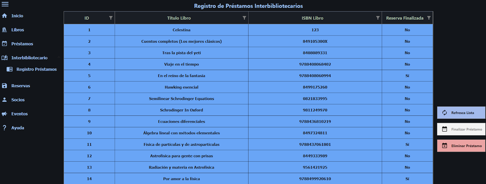

# BiblioAppEscritorio

# 7. Manual de usuario

En este apartado, vamos a desarrollar manuales de usuario muy detallados para que el usuario pueda consultarlo, aclararse y asegurarse de que está utilizando la aplicación de la mejor manera posible.

## 7.1. Aplicación de escritorio

Nada más iniciar la aplicación de escritorio, se le abrirá en el apartado de inicio. Aunque podrá ver un menú lateral con varias opciones. Este menú lateral también se puede contraer.

<table>
  <tr>
   <td>

   </td>
   <td>

   </td>
  </tr>
</table>

Tal y como se muestra en la siguiente imagen, la ventana de inicio está dividida en varias partes. Tenemos la información de contacto por si se quiere consultar en cualquier momento, también tenemos un apartado para apuntar notas en y una lista con los eventos que se llevarán a cabo ese mismo día en la biblioteca. Podrá consultar la hora si se fija en la parte superior de la ventana.

Si pulsa **Libros** en el menú lateral podrá ver una tabla - grid con todos los libros que la biblioteca dispone. Desde esta tabla podrá filtrar cada campo según crea conveniente.

Si pulsa un libro, podrá ver que se muestra información adicional sobre este. Aparece la foto de portada del libro, las unidades disponibles que todavía no están en préstamo, las unidades reservadas y las unidades que dispone la biblioteca.

También podrá ver 2 botones con + y - . Si pulsa el botón + se añadirá una unidad de ese libro a la biblioteca. De la misma manera, si pulsa el botón - se eliminará una unidad siempre y cuando sea posible (que esa unidad no esté reservada ni en préstamo).

En este caso, como hay 2 unidades totales y ambas están reservadas, no se podría eliminar ninguna unidad de libro. 

Debajo de esto podrá ver 6 botones. A continuación se explicará el funcionamiento de cada uno.

**- Refresca Lista:** como su nombre indica, refresca la lista de libros por si no se ha sincronizado bien del todo.

**- Añadir Libro:** Si pulsa este botón, le aparecerá una ventana emergente en la que le saldrá un formulario y una barra de búsqueda.

Sobre este formulario podrá escribir las características del libro. Cabe destacar que los campos obligatorios son, como su nombre indica, obligatorios para poder insertar el libro correctamente. Si no los rellena, se producirá un error y no se insertará el libro en cuestión. 

Si lo prefiere también puede buscar el libro en la barra de búsqueda para que el formulario se autorrellene con los datos obtenidos de APIS de libros.

Si escribe el título/autor/isbn que desee encontrar y le pulsa a la lupa, se hará una búsqueda en una API de libros y si obtiene resultados, los escribe en los campos. Si ve que hay campos obligatorios que no se han podido rellenar automáticamente, debe rellenarlos a mano para poder insertar el libro correctamente.

Si le da al botón de **Examinar Imagen** y elige una imagen local, esa imagen se subirá a un Blob de Azure desde el cual, obtendremos su URL. La URL será lo que se guarde en la base de datos. Si guarda dos archivos con el mismo nombre, se eliminará el más antiguo antes de subir el último.

**- Editar Libro:** Si selecciona un libro del grid, podrá ver que se deshabilita el botón de editar libro.

Si pulsamos este botón, se abrirá una ventana con los datos del libro seleccionado para poder editarlos. Si después de haberlo modificado (o no), pulsa el botón Editar Libro, se guardarán todos los cambios. Si pulsa cancelar se cancelarán.

**- Eliminar Libro:** Si selecciona un libro y ve que el botón de Eliminar libro está habilitado, ese libro no tiene unidades en préstamo y, por tanto, se podrá eliminar.

De esta manera, si pulsa aceptar ese libro junto con todas sus unidades serán eliminadas.

**- Añadir Préstamo: **Si selecciona un libro y ve que el botón de Añadir Préstamo está habilitado, ese libro tiene unidades disponibles para el préstamo.

Si pulsa este botón se le abrirá una nueva ventana, con los datos del libro, en la cual tendrá que poner el DNI del socio que quiere tomar en préstamo ese libro. Si ha introducido bien el DNI, se actualizará la ventana con los datos del socio.

<table>
  <tr>
   <td>

   </td>
   <td>

   </td>
  </tr>
</table>

**- Añadir Reserva: **De la misma forma que con el anterior botón, si selecciona un libro y ve que el botón de Añadir Reserva está habilitado, ese libro tiene unidades disponibles para reservar.

Si pulsa este botón se le abrirá una nueva ventana, con los datos del libro, en la cual tendrá que poner el DNI del socio que quiere reservar este libro. Si ha introducido bien el DNI, se actualizará la ventana con los datos del socio. Si le da a crear reserva, se creará la reserva de ese libro y ese socio.

<table>
  <tr>
   <td>

   </td>
   <td>

   </td>
  </tr>
</table>

A continuación pasaremos al siguiente apartado, el de los** préstamos**.

Si pulsa el apartado de préstamos que tiene en el menú lateral, podrá observar que se cargan los datos de todos los préstamos de la biblioteca. Estos datos incluyen tanto los del préstamo, como los del socio y libro.

Si selecciona un préstamo, se cargará la portada en la parte derecha de la ventana y, dependiendo de si el préstamo ha sido finalizado o no, se habilitará un botón u otro.

Si el préstamo seleccionado ha finalizado, el botón de **eliminar préstamo** estará habilitado, de tal forma que, podrá eliminar el préstamo. El botón de finalizar préstamo estará deshabilitado ya que este préstamo ya ha sido finalizado.

Si el préstamo seleccionado no ha finalizado, el botón de **finalizar préstamo** estará habilitado, de tal forma que, podrá finalizar el préstamo.  El botón de eliminar préstamo estará deshabilitado ya que no se puede eliminar un préstamo que no haya sido finalizado.

Para ambas opciones saltará una ventana para asegurarse de que de verdad quiere finalizar/eliminar el préstamo.

<table>
  <tr>
   <td>

   </td>
   <td>

   </td>
  </tr>
</table>

El siguiente apartado que podrá observar en el menú es el de Interbibliotecario. En este apartado podrá consultar libros que estén en otra biblioteca para solicitar un préstamo interbibliotecario.

Si escribe cualquier referencia al libro que busca y le da al botón de la lupa le aparecerá una lista de libros según haya encontrado resultados.

Si encuentra el libro que buscaba y le interesa solicitarlo a la otra biblioteca, puede hacerlo seleccionando el libro en cuestión y dándole al botón de solicitar libro. Le saltará una ventana de comprobación para asegurarse de que quiere solicitar este libro.

Si le da a aceptar, se añadirá el libro al registro de préstamos interbibliotecarios que veremos a continuación.

Si seleccionamos el apartado **Registro de préstamos** que está dentro del apartado de préstamos interbibliotecarios, podrá observar una lista con todos los libros que han sido solicitados a otra biblioteca para realizar préstamo interbibliotecarios y si han sido finalizados y devueltos a su biblioteca de origen.

Si selecciona un préstamo que ha sido finalizado y devuelto, el botón de Eliminar préstamo se habilitará. De la misma manera, si pulsa un préstamo que no ha sido finalizado, se habilitará el botón de finalizar préstamo.

Se abrirá la siguiente ventana para confirmar que quiere realizar la acción.

<table>
  <tr>
   <td>

   </td>
   <td>

   </td>
  </tr>
</table>

El siguiente apartado es el de **Reservas**.

Si selecciona este apartado en el menú lateral podrá ver que se muestran los datos de los libros reservados.

Si selecciona una reserva, se cargará la portada del libro en la parte derecha de la ventana y, dependiendo de si la reserva ha sido finalizada o no, se habilitará un botón u otro.

<table>
  <tr>
   <td>

   </td>
   <td>

   </td>
  </tr>
</table>

Si la reserva seleccionada ha finalizado, el botón de eliminar reserva estará habilitado, de tal forma que, podrá eliminar la reserva. El botón de finalizar reserva estará deshabilitado ya que esta reserva ya ha sido finalizada.

Si la reserva seleccionada no ha finalizado, el botón de finalizar reserva estará habilitado, de tal forma que, podrá finalizar el préstamo.  El botón de eliminar reserva estará deshabilitado ya que no se puede eliminar una reserva que no haya sido finalizada.

<table>
  <tr>
   <td>

   </td>
   <td>

   </td>
  </tr>
</table>

El apartado que tenemos a continuación es el de Socios, en él, se podrá tener una gestión de los socios de la biblioteca así como ver los libros que tiene reservados y en préstamo.

Si pulsa el botón de **Añadir socio**, le saltará una ventana desde la cual deberá rellenar los datos del socio a insertar respetando los campos obligatorios (son todos menos las categorías).

Si seleccionamos un socio, podrá ver que si tiene préstamos y/o reservas, aparecerán en la parte inferior de la pantalla.

Una vez seleccionado el socio, si pulsa el botón **Editar Socio**, se abrirá una ventana con los datos de ese socio en la cual podrá modificar los datos o restablecer la contraseña si fuese necesario (por defecto la contraseña es el DNI del socio).

Por último, si seleccionamos un socio y el botón de Eliminar socio está habilitado, significa que no tiene reservas ni préstamos pendientes. De esta forma, si pulsa el botón podrá eliminar al socio.

El siguiente apartado es el de **Eventos**, en el que podrá ver que se muestra una lista con todos los eventos que se han realizado y los que se van a realizar en la biblioteca.

También podemos diferenciar 4 botones: Refresca Lista para refrescar la lista de eventos si hiciera falta, el de Añadir Evento, Editar Evento y Eliminar Evento.

Si pulsa el botón de **Añadir Evento**, verá que le saldrá una ventana con un formulario para rellenar los datos del evento y así poder añadirlo.

Si selecciona un evento y pulsa el botón de **Editar Evento**, podrá ver que se le abre una ventana con los datos del evento seleccionado. Estos datos podrán ser editados después de modificarlos pulsando el botón de Editar Evento.

Si selecciona un evento y pulsa el botón **Eliminar Evento**, le saldrá una ventana de confirmación para poder eliminarlo.

El último apartado que podrá encontrar en la aplicación de escritorio es el de** Ayuda.** Si selecciona este apartado del menú lateral se le abrirá un manual de usuario de la aplicación.

